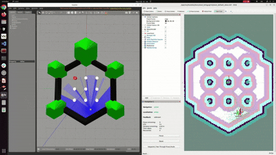
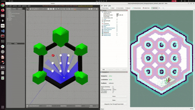

```markdown
# ROS2 Navigation2 Tutorial with TurtleBot3

This tutorial demonstrates how to set up the ROS2 Navigation2 (Nav2) stack using TurtleBot3 Waffle in Gazebo, and how to compare different Local Planners such as MPPI, RPP, and DWB.  
The guide follows a clean, step-by-step structure from workspace creation to the final navigation run.
```

## 📚 Additional Resources

### 🎥 Lecture Video Playlist  
Full lecture video series explaining the Navigation2 tutorial step-by-step:  
📌 https://youtube.com/playlist?list=PLR4lJcpVpJSEiJUTqWDRhnwcteonD2tSf&si=-ajkJ8IyBLEh98-T

### 📝 Tutorial PPT Slides  
Slides used throughout the course (Google Drive folder):  
📌 https://drive.google.com/drive/folders/1XoZbC4QC7uE7bXU2JYIVYcnH9F3qI1-M?usp=sharing

---

## 1. Environment

- OS: Ubuntu 22.04
- ROS2: Humble
- Simulator: Gazebo + RViz2
- Robot: TurtleBot3 Waffle

### Objectives
- Build a functional Nav2 simulation environment
- Run mapping & localization-based navigation
- Switch local planners (MPPI / RPP / DWB) and observe differences
- Optionally connect to Unity-based Nav2 SLAM demo

---

## 2. Prerequisites

### 2.1 Install Required Packages

```bash
sudo apt update
sudo apt install -y \
  ros-humble-turtlebot3* \
  ros-humble-navigation2 \
  ros-humble-nav2-bringup \
  ros-humble-gazebo-ros-pkgs
````

These packages install TurtleBot3 models, Nav2 stacks, and Gazebo integration.

---

## 3. Create the Workspace (`turtlebot3_ws`)

### 3.1 Create Workspace Structure

```bash
mkdir -p ~/turtlebot3_ws/src
cd ~/turtlebot3_ws/src
```

### 3.2 Clone the Tutorial Repository

Clone directly into the `src` folder:

```bash
git clone https://github.com/san2642/ROS2_Tutorial_Navigation2.git .
```

Expected structure:

```
custom_interfaces/
gcamp_gazebo/
py_action_pkg/
turtlebot3_navigation2/
turtlebot3_simulations/
...
```

---

## 4. Build the Workspace

### 4.1 Build

```bash
cd ~/turtlebot3_ws
colcon build --symlink-install
```

### 4.2 Source the Setup Script

```bash
source ~/turtlebot3_ws/install/setup.bash
```

### 4.3 Set TurtleBot3 Model

```bash
echo "export TURTLEBOT3_MODEL=waffle" >> ~/.bashrc
source ~/.bashrc
```

---

## 5. Running Gazebo + Nav2

### **Run Order**

1. Launch Gazebo simulation
2. Launch Nav2 (AMCL + planner server)
3. Open RViz and set initial pose
4. Send navigation goals
5. Swap local planners (MPPI/RPP/DWB)

---

### 5.1 Launch Gazebo (Terminal 1)

```bash
source ~/turtlebot3_ws/install/setup.bash
ros2 launch turtlebot3_gazebo turtlebot3_world.launch.py
```

Gazebo will open with a TurtleBot3 Waffle spawned in the default world.

---

### 5.2 Launch Nav2 + AMCL (Terminal 2)

```bash
source ~/turtlebot3_ws/install/setup.bash

ros2 launch turtlebot3_navigation2 navigation2.launch.py \
  map:=/home/home/turtlebot3_ws/src/turtlebot3_navigation2/map/map.yaml \
  params_file:=/home/home/turtlebot3_ws/src/turtlebot3_navigation2/param/mppi.yaml \
  use_sim_time:=true
```

* `map.yaml`: Static map file
* `params_file`: Select local planner config

  * `mppi.yaml`
  * `rpp.yaml`
  * `dwa.yaml`

**Tip:** Simply change `params_file=` to switch planners.

---

### 5.3 RViz Navigation Steps

1. Set pose with **2D Pose Estimate**
2. Send a destination with **Nav2 Goal**
3. Robot starts navigating using selected Local Planner
   (traj lines & costmap visible)

---
## 6.1 MPPI Local Planner

Model Predictive Path Integral (MPPI) generates hundreds of trajectory samples, evaluates costs, and selects the optimal one at each step.

### Features

* Smooth and stable motion in complex environments
* Adjustable exploration vs stability via temperature parameter
* Strong performance in cluttered scenes

### Main Parameters

* `batch_size` – number of sampled trajectories
* `time_steps` – prediction horizon
* `temperature` – sampling randomness scale

### Run with MPPI

```bash
ros2 launch turtlebot3_navigation2 navigation2.launch.py \
  map:=.../map.yaml \
  params_file:=.../mppi.yaml \
  use_sim_time:=true
````

### Example Video



*MPPI Local Planner navigation*

---

## 6.2 DWB (DWA-based) Local Planner

The Dynamic Window Approach (DWA/DWB) generates velocity samples and evaluates short-horizon trajectories.

### Features

* Fast, reactive motion
* Good obstacle avoidance
* Can oscillate or overshoot in sharp turns

### Main Parameters

* `sim_time` – prediction window
* `vx_samples`, `vy_samples` – velocity samples
* `path_align_scale`, `obstacle_scale`

### Run with DWB

```bash
ros2 launch turtlebot3_navigation2 navigation2.launch.py \
  map:=.../map.yaml \
  params_file:=.../dwa.yaml \
  use_sim_time:=true
```

### Example Video


*DWB Local Planner navigation*

---

## 6.3 RPP (Regulated Pure Pursuit)

RPP follows a lookahead target point and regulates speed near obstacles.

### Features

* Very smooth and predictable motion
* Automatically slows down near obstacles
* Can feel less responsive in tight spaces

### Main Parameters

* `lookahead_dist`
* `use_cost_regulated_linear_velocity_scaling`
* `min_approach_linear_velocity`

### Run with RPP

```bash
ros2 launch turtlebot3_navigation2 navigation2.launch.py \
  map:=.../map.yaml \
  params_file:=.../rpp.yaml \
  use_sim_time:=true
```

### Example Video



*RPP Local Planner navigation*

---
## 7. Summary

This tutorial allows you to:

* Build a complete Nav2 simulation with TurtleBot3
* Use AMCL-based localization and goal navigation
* Compare three Local Planners (MPPI / RPP / DWB) with the same environment
* Analyze how each planner handles obstacles, path tracking, and speed control
* Extend the environment to Unity if needed


Happy navigating!
